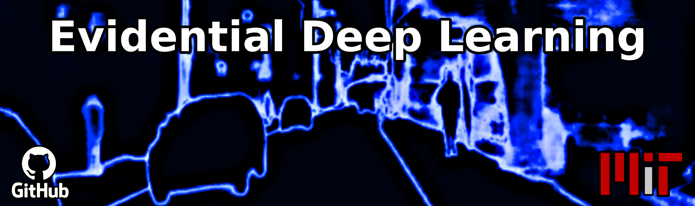
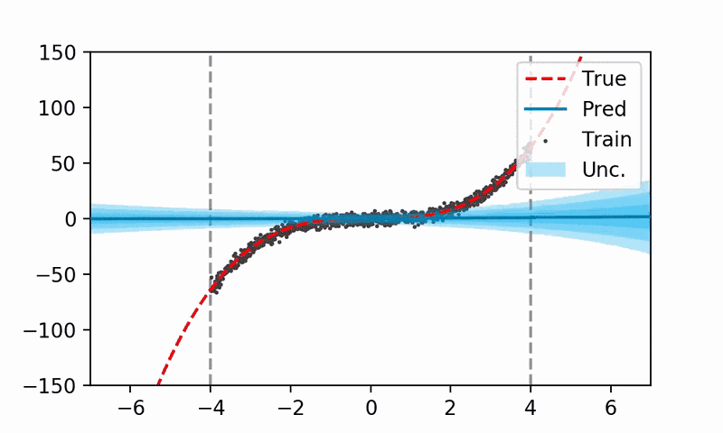

# Evidential Deep Learning

<h3 align='center'>"All models are wrong, but some — <i>that know when they can be trusted</i> — are useful!"</h3>
<p align='right'><i>- George Box (Adapted)</i></p>




This repository contains the code to reproduce [Deep Evidential Regression](https://proceedings.neurips.cc/paper/2020/file/aab085461de182608ee9f607f3f7d18f-Paper.pdf), as published in [NeurIPS 2020](https://neurips.cc/), as well as more general code to leverage evidential learning to train neural networks to learn their own measures of uncertainty directly from data!

## Setup
To use this package, you must install the following dependencies first: 
- python (>=3.7)
- tensorflow (>=2.0)
- pytorch (support coming soon)

Now you can install to start adding evidential layers and losses to your models!
```
pip install evidential-deep-learning
```
Now you're ready to start using this package directly as part of your existing `tf.keras` model pipelines (`Sequential`, `Functional`, or `model-subclassing`):
```
>>> import evidential_deep_learning as edl
```

### Example
To use evidential deep learning, you must edit the last layer of your model to be *evidential* and use a supported loss function to train the system end-to-end. This repository supports evidential layers for both fully connected and convolutional (2D) layers. The evidential prior distribution presented in the paper follows a Normal Inverse-Gamma and can be added to your model: 

```
import evidential_deep_learning as edl
import tensorflow as tf

model = tf.keras.Sequential(
    [
        tf.keras.layers.Dense(64, activation="relu"),
        tf.keras.layers.Dense(64, activation="relu"),
        edl.layers.DenseNormalGamma(1), # Evidential distribution!
    ]
)
model.compile(
    optimizer=tf.keras.optimizers.Adam(1e-3), 
    loss=edl.losses.EvidentialRegression # Evidential loss!
)
```


Checkout `hello_world.py` for an end-to-end toy example walking through this step-by-step. For more complex examples, scaling up to computer vision problems (where we learn to predict tens of thousands of evidential distributions simultaneously!), please refer to the NeurIPS 2020 paper, and the reproducibility section of this repo to run those examples. 

## Reproducibility
All of the results published as part of our NeurIPS paper can be reproduced as part of this repository. Please refer to [the reproducibility section](./neurips2020) for details and instructions to obtain each result. 

## Citation
If you use this code for evidential learning as part of your project or paper, please cite the following work:  

    @article{amini2020deep,
      title={Deep evidential regression},
      author={Amini, Alexander and Schwarting, Wilko and Soleimany, Ava and Rus, Daniela},
      journal={Advances in Neural Information Processing Systems},
      volume={33},
      year={2020}
    }
